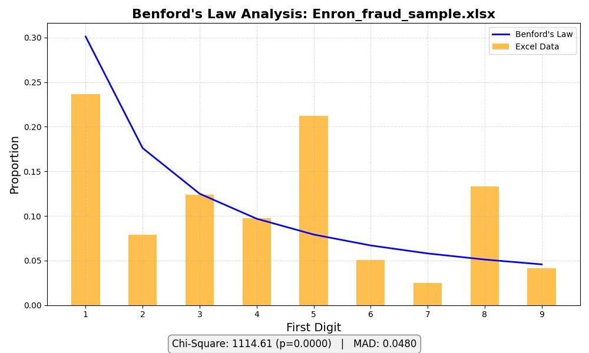

## BenfordsLaw_Tester.py 
This script models Benford’s Law by generating and comparing authentic versus manipulated financial data. It outputs frequency distributions to Excel for forensic analysis, helping identify statistical anomalies suggestive of fraud."


Installation:
```
python pip install -r requirements_benfords.txt
```

Usage:\
analyze numbers
```
python BenfordsLaw_Tester.py -c -I benfordsLaw_tester.xlsx
```


help menu
```
python BenfordsLaw_Tester.py -h
```

Example:

    BenfordsLaw_Tester.py -b
	
    BenfordsLaw_Tester.py -b -I benfordsLaw_tester.xlsx

    BenfordsLaw_Tester.py -b -I benfordsLaw_tester.xlsx -c b
		
Note:
this currently reads column A in the first sheet use -c to specify a differnt column.
	
	
	
	
## Benford's Law (Blue line)
Benford's Law, also known as the First-Digit Law, is a statistical principle that predicts 
the frequency distribution of leading digits in naturally occurring datasets. 
According to this law:
• 	The number 1 appears as the leading digit about 30% of the time.
• 	Higher digits occur less frequently, with 9 appearing as the first digit less than 5% of the time.
This counterintuitive pattern holds true across many datasets—such as financial records, 
population numbers, and scientific measurements—especially when the data spans several orders of magnitude.

Benford's Law is widely used in fraud detection, particularly in accounting and forensic analysis. 
Deviations from the expected distribution can signal manipulation or anomalies in the data.
The blue line gives a baseline of what Benford's law should look like, as a baseline.

## Manipulated Data (Red column)
The Manipulated Data section simulates financial values that are artificially rounded 
to the nearest thousand, creating unnaturally uniform distributions. These values do not 
follow the logarithmic pattern predicted by Benford’s Law, which typically governs organic 
datasets. By comparing the first-digit frequency of this manipulated data to Benford's 
expected distribution, the model helps demonstrate how fabricated or tampered numbers 
diverge from statistical norms.

## Authentic Data (Green column)
The Authentic Data section contains numerical values that are naturally occurring 
and statistically organic. These figures are either real-world samples or generated 
using randomization techniques that closely mimic legitimate datasets. They tend to 
follow Benford’s Law, which predicts the frequency of first digits in many 
naturally formed datasets.

## Chi-Square Test
The Chi-Square Test is a statistical method used to evaluate whether observed frequencies 
in a dataset differ significantly from expected frequencies under a certain hypothesis. 
It's commonly applied to categorical data—like survey responses, classifications, or 
groupings—to test for independence or goodness-of-fit.
The bigger the number, the less likely it is that the differences occurred by chance, 
and the more likely it is that something meaningful is happening in the data.

Chi-Square Test ➤ Stat: 1114.61


