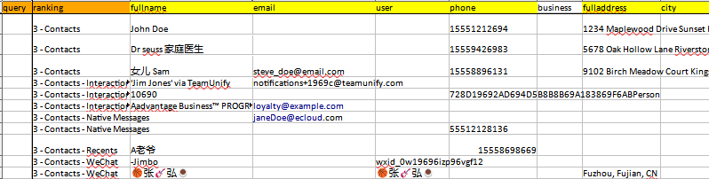

## cellebrite_parser.py 
convert Cellebrite contacts, account, web history, chats and call exports to intel format

note: the spreadsheet has to have the top row deleted so that the columns become the first row.


Installation:
```
python pip install -r requirements_cellebrite_parser.txt
```

Usage:\
process call logs
```
python cellebrite_parser.py -c -I calls.xlsx
```

create blank input_blank.xlsx
```
python cellebrite_parser.py -b -O input_blank.xlsx
```

help menu
```
python cellebrite_parser.py
```

Example:
    cellebrite_parser.py -b -O input_blank.xlsx
    cellebrite_parser.py -C -I Accounts.xlsx
    cellebrite_parser.py -C -I Calls.xlsx
    cellebrite_parser.py -C -I Chats.xlsx
    cellebrite_parser.py -C -I Contacts.xlsx
    cellebrite_parser.py -C -I SearchedItems.xlsx
    cellebrite_parser.py -C -I WebHistory.xlsx
	
	
	
	
