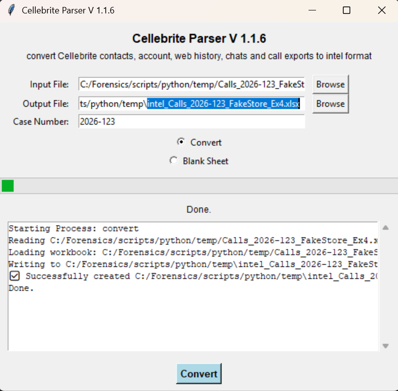

## cellebrite_parser.py 
convert Cellebrite contacts, account, web history, chats and call exports to intel format


Installation:
```
python pip install -r requirements_cellebrite_parser.txt
```

Usage:

GUI Interface
```
python cellebrite_parser.py

```
	
	

	


or command line:

process call logs
```
python cellebrite_parser.py -c -I calls.xlsx
```

create blank input_blank.xlsx
```
python cellebrite_parser.py -b -O input_blank.xlsx
```

help menu
```
python cellebrite_parser.py
```

Example:

    cellebrite_parser.py -b -O input_blank.xlsx
	
    cellebrite_parser.py -C -I Accounts.xlsx
	
    cellebrite_parser.py -C -I Calls.xlsx
	
    cellebrite_parser.py -C -I Chats.xlsx
	
    cellebrite_parser.py -C -I Contacts.xlsx
	
    cellebrite_parser.py -C -I SearchedItems.xlsx
	
    cellebrite_parser.py -C -I WebHistory.xlsx
	
	
	
	


## CellebriteEmailxlsx2xlsx.py

Read a Cellebrite email export parse it and export it out.

This example reads SmilePOS emails and parses out the details.

You can re-arrange the headers to meet your needs.


Example:

```
   python  CellebriteEmailxlsx2xlsx.py -r
   
   python CellebriteEmailxlsx2xlsx.py -r -I Cellebrite_Emails.xlsx -O Cellebrite_Emails_Parsed.xlsx
```

