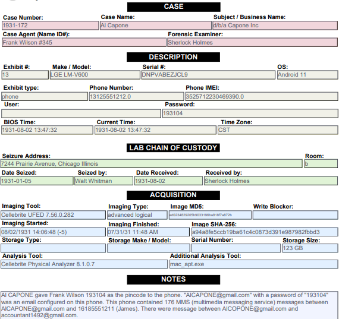

## ForensicsReporter.py 
Convert forensic imaging logs to xlsx, print stickers and write activity reports/ case notes

### -l # parse any of the following imaging logs:
* Cellebrite
* GrayKey
* Tablaue
* Berla
* FTK


Installation:
```
python pip install -r requirements_ForensicsReporter.txt
```

Usage:\
process one log at a time by putting your log into input.txt
```
python ForensicsReporter.py -l
```
or do many at once by putting many logs into /Logs folder
```
python ForensicsReporter.py -L
```


### -s # print stickers
paste 1 or more rows from the spreadsheet into input.txt, print out stickers for labeling evidence\
(future plan: print avery labels with QR codes)

Usage:
```
python ForensicsReporter.py -s
```


### -r or -r -c
print out a report. You can replace Blank_ActivityReport.docx with your report template. (sorry it doesn't print data into the header area)\
if you do the -c option you can also replace Blank_EvidenceForm.pdf with your case notes pdf as long as you replace the variables.

Usage:
-r for just activity report
```
python ForensicsReporter.py -r
```


or do -r -c for case notes output (and activity report)
```
python ForensicsReporter.py -r -c
```


## Spreadsheet_reorder.py

in case you want to re-order the columns in your case xlsx.