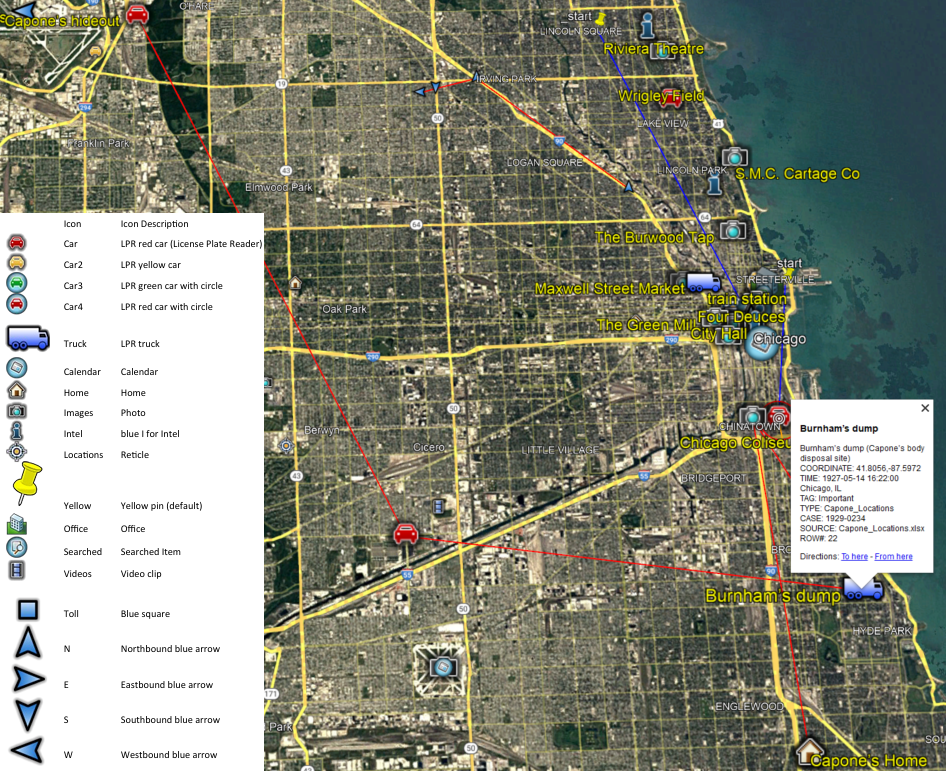

## GPS2Address.py
read GPS coordinates and convert them to addresses

or

read addresses and convert them to coordinates

and

read GPS coordinates (xlsx) and convert them to KML for review in earth.google.com

additional red lines for trips within a reasonable time. (travel_path_SAMPLE.kml)

Usage:
```
python GPS2Address.py -r
```
insert your GPS or addresses into locations.xlsx
```
Example:
    GPS2Address.py -c -O input_blank.xlsx
    GPS2Address.py -k -I locations.xlsx  # xlsx 2 kml with no internet processing
    GPS2Address.py -r
    GPS2Address.py -r -I locations.xlsx -O locations2addresses_.xlsx
```    
*   Visit earth.google.com, File,Import KML 




Icons
*   Car -Lpr red car (License Plate Reader)
*   Car2 -Lpr yellow car
*   Car3 -Lpr greeen car with circle
*   Car4 -Lpr red car with circle
*   Truck -Lpr truck
	
*   Calendar
*   Home
*   Images -Photo
*   Intel -I
*   Locations -Reticle
*   default -Yellow flag
*   Office
*   Searched -Searched Item
*   Videos -Video clip
	
*   Toll -Blue square
*   N -Northbound blue arrow
*   E -Eastbound blue arrow
*   S -Southbound blue arrow
*   W -Westbound blue arrow
	
*   Chats
*   Tower -Bullseye

*   Yellow font -Tagged
*   blue lines -trips with a start and end
*   red circles -indicate radius of the signal and/or accuracy of the point

---
