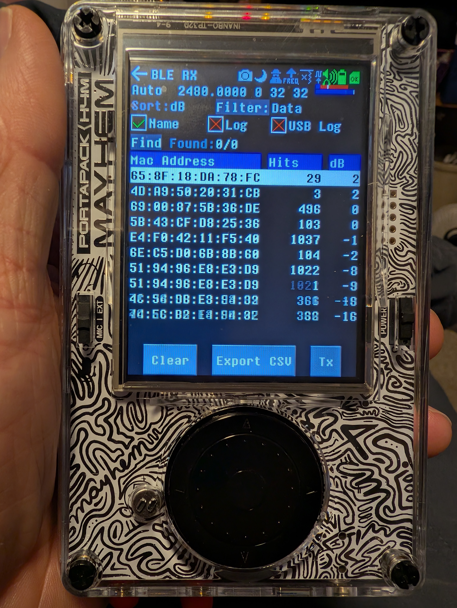

# WarDriveParser.py

Convert wigle .gz or .csv exports to gps2address.py locations format or convert HackRf logs. 

Convert MAC to company name.


## Example:
  python WarDriveParser.py -b      # create a blank sheet

  python WarDriveParser.py -C      # clear logs off the HackRF

  python WarDriveParser.py -L      # log grabber (HackRF)

  python WarDriveParser.py -p      # parse HackRF text

  python WarDriveParser.py -p -I logs -O WarDrive_.xlsx

  python WarDriveParser.py -w -I WigleWifi_Neighborhood.csv.gz     # parse wigle log

  python WarDriveParser.py -w -I WigleWifi_sample.csv

## Installation:
```
python pip install -r requirements_WarDriveParser.txt
```
or 
```
pip install openpyxl
```


## Usage:


```
python WarDriveParser.py
```


## Note:

Wigle(.)net has an app for Android devices.

Bluetooth was captured with HackRF Porta pack h4

Install a Comet antenna (insert correct length here)
turn on HackRF
(Receive)(BLE RX)

Logs are saved in: H:\BLERX\Lists\*.csv

and

Logs are saved in: H:\BLERX\Logs\*.txt

additional logs to parse:
H:\LOGS\ADSB.TXT
H:\LOGS\AIS.TXT
H:\LOGS\random.TXT
H:\LOGS\TPMS.TXT
H:\LOGS\APRS.TXT





[Wiki](https://github.com/portapack-mayhem/mayhem-firmware/wiki/Bluetooth-Low-Energy-Receiver)
