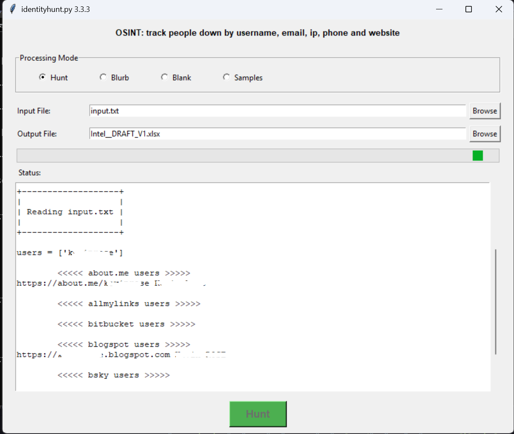

# identityhunt (identiyhunt.py or identityhunt.exe)
OSINT: track people down by username, email, ip, phone and website. 

## installation:

pip install -r requirements_identity_hunt.txt

## directions:
insert emails, phone numbers, usernames into input.txt

Usage:

default behavior is a GUI interface
```
python identityhunt.py

or

double click identityhunt.exe
or
python identityhunt.py (from command prompt) 
```




