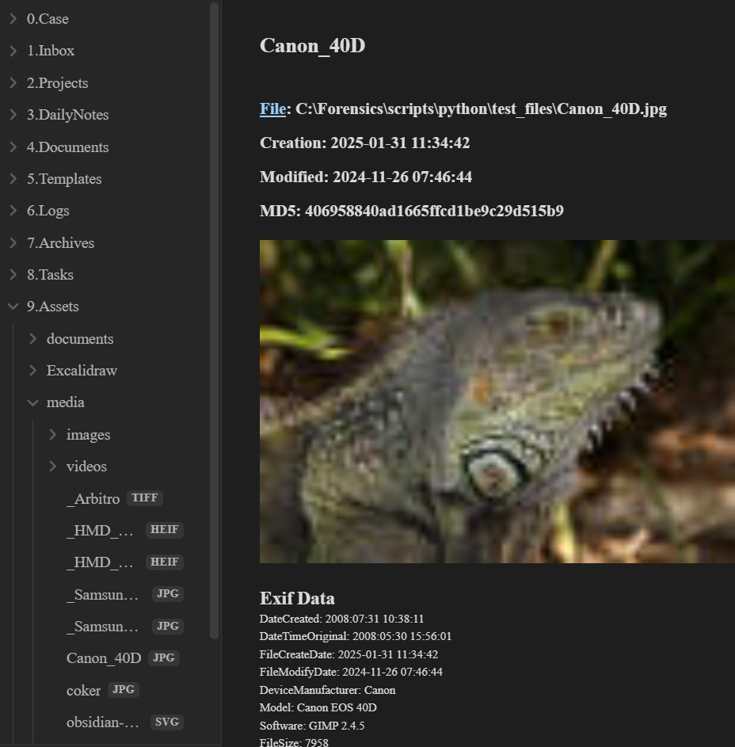
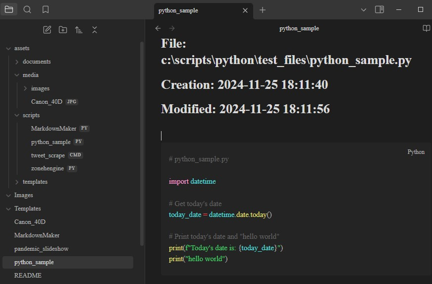
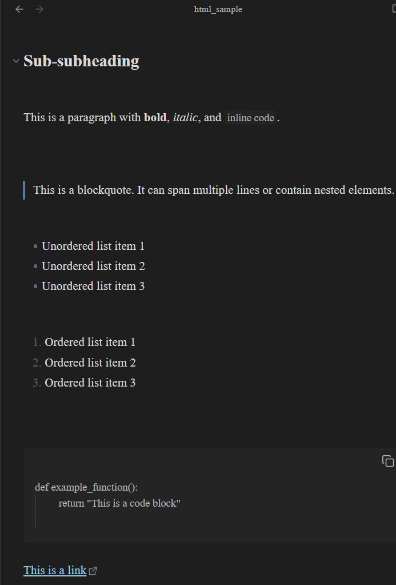
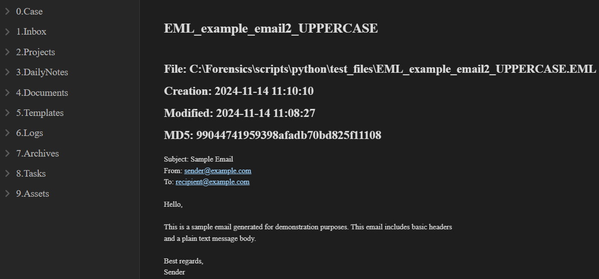
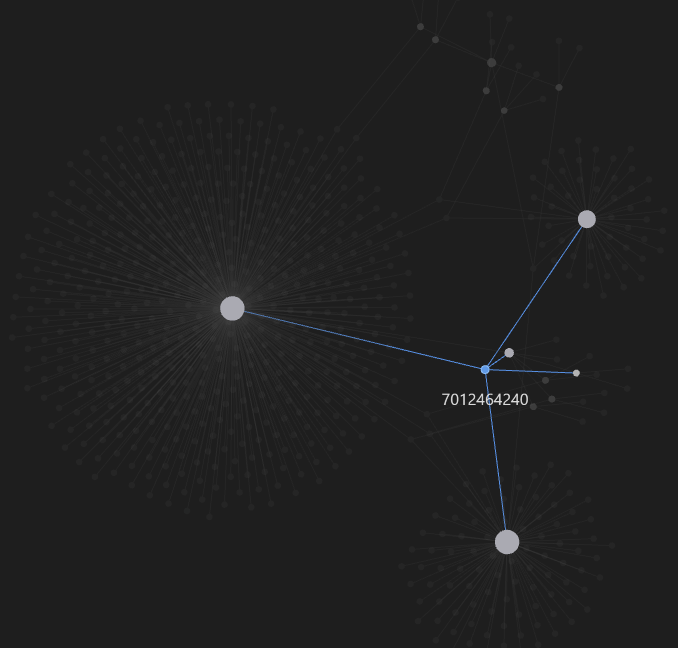
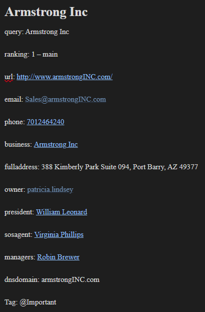
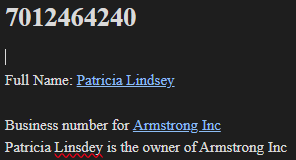
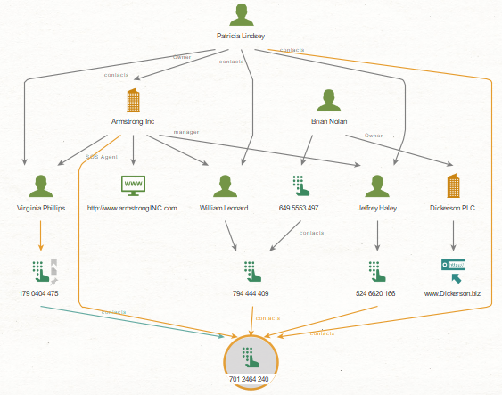

# MarkdownMaker (MarkdownMaker.py)
Convert documents and files into unified markdown files for use with Obsidian, Notion, Gitub Readme's and other Markdown notebooks. (-c)

Can also be used to create a basic Obsidian notebook install, with some settings set. (-b -t)


## installation:

pip install -r requirements_MarkdownMaker.txt

## directions:
pick a folder with files and even subfolders with a variety of different filetypes. 

## options:

-h, --help	show this help message and exit

-I INPUT	Input folder path

-O OUTPUT	Output folder path

-T TEMPLATE	template path

-c, --convert 	Convert files to markdown

-b, --blank	create a blank obsidian folder

-t, --template	copy templated obsidian files/folders

  
## Usage:


```
python MarkdownMaker.py -c (from command prompt) 
```

## Example
```
python MarkdownMaker.py -c -I c:\scripts\python\test_files -O c:\scripts\python\ObsidianNotebook
```


create a blank obsidian folder with default folders and settings
```
python MarkdownMaker.py -b 
```

or

create a blank obsidian case from a template folder (2 folders have been included

Template_2ndBrain - for a standard 2nd brain setup

Template_Cases - for a new case notes file

```
python MarkdownMaker.py -b -t -T Template_Cases
```

## help

```

python MarkdownMaker.py -H
```


Supported images with exif data will have that displayed under the image
![[9.Assets/Images/ScreenshotExifData1.jpg]]




Scripts will be added to the scripts folder and get added markup language for scripts like python




 
Documents will be added to the documents folder and get added markup language for files like .pdf, .html, .docx, .rtf and more.
There is often a link to the orginal file.

html sample




eml sample




# How to use xlsx2markdown.py for Intel hunting and visualization with Obsidian Graph View:


Scripts can be found at https://github.com/lincolnlandforensics

research real OSINT information like phone numbers and emails

You can always get help with a -H

```
python identityhunt.py -H
```

To search intel.txt for OSINT information:

```
python identityhunt.py -I intel.txt -O Intel_sample.xlsx
```

or Use cellebrite_parser.py to extract the contacts from a phone

```
python cellebrite_parser.py -C -I Contacts_William_Leonard.xlsx

```

or create a fake set of identities. I created 3 sets of contacts with 3 - 12 identities overlapping between the sets for this demo

```
python fake-factory.py -f -n -100 -o fake_identities.xlsx
```

Create a spreadsheet [[FakeIdentities_sample.xlsx]] with a sheet for each contact and a Master Intel sheet for the overlapping Data. Merge the output into individual sheets in the same xlsx file.


Select each individual contact sheet, hit save and then run the following command:

```
python xlsx2markdown.py -c -I FakeIdentities_sample.xlsx
```

Rinse, lather, repeat for each sheet of contacts.


To do a deeper dive, select the Intel sheet which is where you have enhanced the data with research which includes all the overlapping contacts. To create a node for most of the individual phone numbers in the contact sheet, select the Intel sheet, hit save and then:

```
python xlsx2markdown.py -x -I FakeIdentities_sample.xlsx
```

See the output_markdown subfolder. Open it with Obsidian notebook (https://obsidian.md/)

Click the graph icon and start exploring the data looking for the links between the sets of contacts. 





Click a link like a common company "Armstrong inc" and enhance the data with more research. 



Can link things like phone numbers and Business names with a double square bracket.



See sample obsidian folder included (output_markdown)

### bonus - render your diagram with Maltego or Canvas

Maltego is my favorite




Obsidian Canvas is ok and supports Photos


## setup_case_folder.cmd

Use setup_case_folder.cmd to setup your case files for a case (run it from the root directory like E:\): 

```
setup_case_folder.cmd
```

	Enter case number: 1931-172

	Enter case name: Al_CAPONE

	Directory structure for case 1931-172_Al_CAPONE created successfully.

		Cases

		CaseWF

		Cases\1931-172_Al_CAPONE

		Cases\1931-172_Al_CAPONE\DigitalEvidence

		Cases\1931-172_Al_CAPONE\Ex

		Cases\1931-172_Al_CAPONE\Notes_1931-172_Al_CAPONE

		Cases\1931-172_Al_CAPONE\DigitalEvidence\Photos

		Cases\1931-172_Al_CAPONE\Ex\Image

		CaseWF\1931-172_Al_CAPONE

		CaseWF\1931-172_Al_CAPONE\Ex

		CaseWF\1931-172_Al_CAPONE\Ex\Case

		CaseWF\1931-172_Al_CAPONE\Ex\Exports

		CaseWF\1931-172_Al_CAPONE\Ex\imageCOPY


