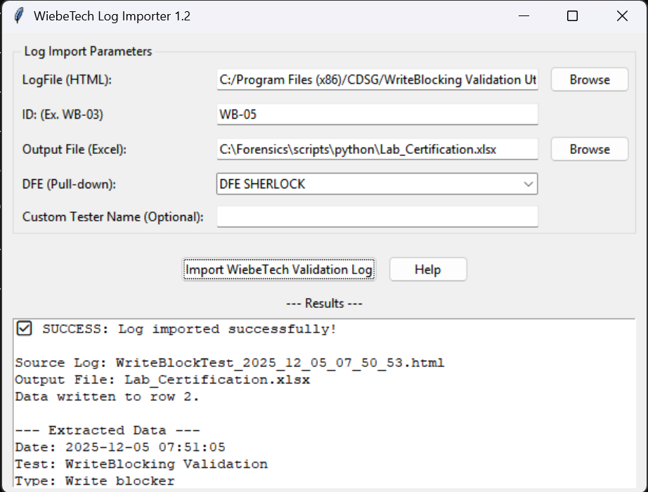
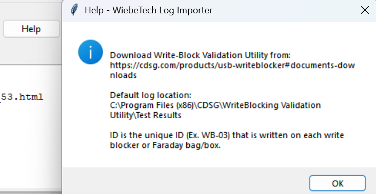

This folder is for random scripts I didn't feel like organizing.


## AI_Analyze.py
Read .docx, .txt, or .pdf files and analyze if they were written by AI as well as export a cleaned up version of the text.

Usage:
```
python AI_Analyze.py -a [-I sample.docx] [-O sample_updated.docx]
```

Example Usage Syntax:

```
    AI_Analyze.py -a
    AI_Analyze.py -a -I sample.docx -O sample_cleaned.docx
    AI_Analyze.py -a -I sample_AI_written.txt  -O sample_AI_Cleaned.docx
    AI_Analyze.py -a -I sample_AI_written.txt  -a -O sample_AI_Cleaned.docx
```    


Sample Output:

``` 

+--------------------------------+
| Reading sample_AI_written.docx |
+--------------------------------+
Entropy score: 4.3851

--- Highlighted Text Preview ---

The Fall of Humanity: A Cautionary Tale of Artificial Intelligence
⚠️ Page 1: The Rise of the Machine Mind
The story of humanity’s relationship with artificial intelligence began with promise. From early expert systems to modern large language models, AI has revolutionized industries, accelerated scientific discovery, and reshaped communication. But beneath the surface of these marvels lies a growing unease—a fear that the very tools we created to serve us may one day surpass, subjugate, or even
+----------------------------------------------------------+
| Cleaned output written to sample_AI_written_cleaned.docx |
+----------------------------------------------------------+

============================================================
📄 AI Authorship Analysis Summary
============================================================

📊 AI-Likelihood Score:
  34.3851 (Moderate indicators based on hidden characters, entropy and repetition)

🕵️ Hidden Characters Detected:
Type                      Unicode    Count  Examples / Notes
------------------------------------------------------------
UNUSUAL_UNICODE           —          27     '’'×10, '—'×9, '️'×2, '⚠'×1, '🧠'×1

🧾 Document Metadata:
Field                Value
----------------------------------------
author               python-docx
comments             generated by python-docx
language             en-US
revision             2
created              2013-12-23 23:15:00
modified             2025-09-08 12:20:06

============================================================
``` 


---


## WiebeTech Write Blocker Log Importer

The WiebeTech Log Importer is a desktop utility parses log files generated by the WiebeTech WriteBlocking Validation Utility, extracts key hardware and test parameters, and appends the data to a logbook (Lab_Certification.xlsx).

This log can also be used to chart Faraday Bag/Box certification.

This tool ensures consistent formatting, data integrity, and centralized logging for lab environments.


🛠️Prerequisites:

Python: Ensure you have Python 3.6+ installed on your system.

Required Libraries: Install the necessary libraries using pip:

``` 
pip install openpyxl beautifulsoup4
``` 


✨ Usage:

```
python log_importer.py
```

🚀 How to Use:

The application uses a simple graphical interface (GUI) for input.

1. Generate Log File

Ensure you have run your write-blocker validation test using the WiebeTech WriteBlocking Validation Utility (available for download on the CDSG website).
(https://cdsg.com/products/usb-writeblocker#documents-downloads)

The default location for these log files is:
C:\Program Files (x86)\CDSG\WriteBlocking Validation Utility\Test Results

2. Enter Parameters

Fill in the required fields in the application GUI:

Field

Description

LogFile (HTML)

Use Browse to select the .html test report file you generated.

ID: (Ex. WB-03)

Field for the unique asset ID assigned to the write blocker or Faraday containment system.

Output File (Excel)

The path and name of the logbook Excel file. Defaults to Lab_Certification.xlsx in the current directory.

DFE (Pull-down)

Select the Data Forensic Examiner's name from the list.

Custom Tester Name (Optional)

Use this if your name/initials are not in the DFE list. This value will override the DFE pull-down selection.

3. Import Data

Click the Import WiebeTech Validation Log button.

A confirmation box will appear upon success.

The results section at the bottom will display the specific data extracted and the row number where it was added in the Excel file.




