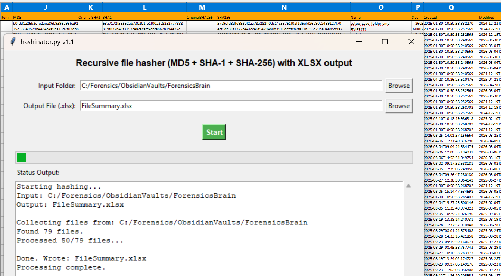

This folder is for random scripts I didn't feel like organizing.


## AI_Analyze.py
Read .docx, .txt, or .pdf files and analyze if they were written by AI as well as export a cleaned up version of the text.

Usage:
```
python AI_Analyze.py -a [-I sample.docx] [-O sample_updated.docx]
```

Example Usage Syntax:

```
    AI_Analyze.py -a
    AI_Analyze.py -a -I sample.docx -O sample_cleaned.docx
    AI_Analyze.py -a -I sample_AI_written.txt  -O sample_AI_Cleaned.docx
    AI_Analyze.py -a -I sample_AI_written.txt  -a -O sample_AI_Cleaned.docx
```    


Sample Output:

``` 

+--------------------------------+
| Reading sample_AI_written.docx |
+--------------------------------+
Entropy score: 4.3851

--- Highlighted Text Preview ---

The Fall of Humanity: A Cautionary Tale of Artificial Intelligence
⚠️ Page 1: The Rise of the Machine Mind
The story of humanity’s relationship with artificial intelligence began with promise. From early expert systems to modern large language models, AI has revolutionized industries, accelerated scientific discovery, and reshaped communication. But beneath the surface of these marvels lies a growing unease—a fear that the very tools we created to serve us may one day surpass, subjugate, or even
+----------------------------------------------------------+
| Cleaned output written to sample_AI_written_cleaned.docx |
+----------------------------------------------------------+

============================================================
📄 AI Authorship Analysis Summary
============================================================

📊 AI-Likelihood Score:
  34.3851 (Moderate indicators based on hidden characters, entropy and repetition)

🕵️ Hidden Characters Detected:
Type                      Unicode    Count  Examples / Notes
------------------------------------------------------------
UNUSUAL_UNICODE           —          27     '’'×10, '—'×9, '️'×2, '⚠'×1, '🧠'×1

🧾 Document Metadata:
Field                Value
----------------------------------------
author               python-docx
comments             generated by python-docx
language             en-US
revision             2
created              2013-12-23 23:15:00
modified             2025-09-08 12:20:06

============================================================
``` 


---


# Hashinator

Hashinator is a Python-based forensics utility that recursively scans a selected directory, calculates cryptographic hashes (MD5, SHA-1, SHA-256) for all files, and extracts basic file metadata. It then exports the findings into a cleanly formatted, easy-to-read Excel (`.xlsx`) workbook.

It features a simple and intuitive GUI built with Tkinter, making it easy to select input directories and specify the output file location without using the command line.

The column format matches the FTK Summary columns.

## Features
- **Recursive Directory Hashing:** Automatically traverses all subdirectories to find and process files.
- **Multiple Hash Algorithms:** Calculates MD5, SHA-1, and SHA-256 hashes simultaneously.
- **Metadata Extraction:** Captures file size, creation dates, and modification dates.
- **Magic Bytes File Type Detection:** Inspects file headers to accurately determine the file type (bypassing simple extension checks).
- **Excel Output:** Generates a formatted `.xlsx` report containing the results, complete with colored headers and customizable column widths.
- **Multi-threaded:** Utilizes Python's `ThreadPoolExecutor` to process multiple files concurrently, speeding up the hashing process.
- **GUI Interface:** Simple Tkinter UI with a progress indicator and status log.

## Requirements

Hashinator requires **Python 3.6+** to run. 

The only external dependency is `openpyxl`, which is used to generate the Excel reports. All other modules used (`os`, `hashlib`, `tkinter`, `threading`, etc.) are included in the Python Standard Library.

## Installation

1. **Clone or download** this repository to your local machine.
2. **Install the required dependencies** using `pip`. Navigate to the script's directory and run:
   ```bash
   pip install -r requirements_hashinator.txt
   ```
   *(Note: On some Linux distributions, you may also need to install Tkinter via your package manager, e.g., `sudo apt-get install python3-tk`)*

## Usage

You can launch Hashinator by simply running the script with Python:

```bash
python hashinator.py
```

### Using the Interface:
1. **Input Folder:** Click "Browse" to select the folder containing the files you want to hash.
2. **Output File:** Click "Browse" to choose where you want to save the `.xlsx` report and what you want to name it.
3. **Start:** Click the "Start" button to begin the hashing process. The progress bar will become active, and the status text window will display real-time updates as files are processed.

Once processing is complete, the status log will indicate that it's done, and you can open your newly created Excel file to review the hashes and file metadata.





---


## pdf_password_remover.py

PDF password remover (if you know it)

Usage:
```
python pdf_password_remover.py
```


---

## WiebeTech Write Blocker Log Importer

The WiebeTech Log Importer is a desktop utility parses log files generated by the WiebeTech WriteBlocking Validation Utility, extracts key hardware and test parameters, and appends the data to a logbook (Lab_Certification.xlsx).

This log can also be used to chart Faraday Bag/Box certification.

This tool ensures consistent formatting, data integrity, and centralized logging for lab environments.


🛠️Prerequisites:

Python: Ensure you have Python 3.6+ installed on your system.

Required Libraries: Install the necessary libraries using pip:

``` 
pip install openpyxl beautifulsoup4
``` 


✨ Usage:

```
python log_importer.py
```

🚀 How to Use:

The application uses a simple graphical interface (GUI) for input.

1. Generate Log File

Ensure you have run your write-blocker validation test using the WiebeTech WriteBlocking Validation Utility (available for download on the CDSG website).
(https://cdsg.com/products/usb-writeblocker#documents-downloads)

The default location for these log files is:
C:\Program Files (x86)\CDSG\WriteBlocking Validation Utility\Test Results

2. Enter Parameters

Fill in the required fields in the application GUI:

Use Browse to select the .html test report file you generated.

ID: (Ex. WB-03) (Only use labeled/tested items)

3. Import Data

Click the Import WiebeTech Validation Log button.

A confirmation box will appear upon success.

The results section at the bottom will display the specific data extracted and the row number where it was added in the Excel file.


 