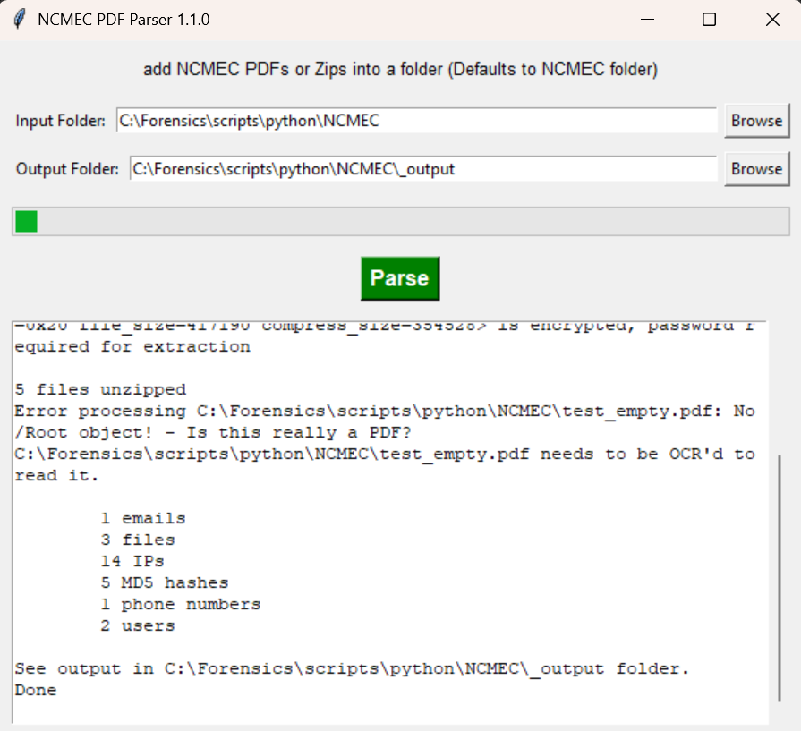
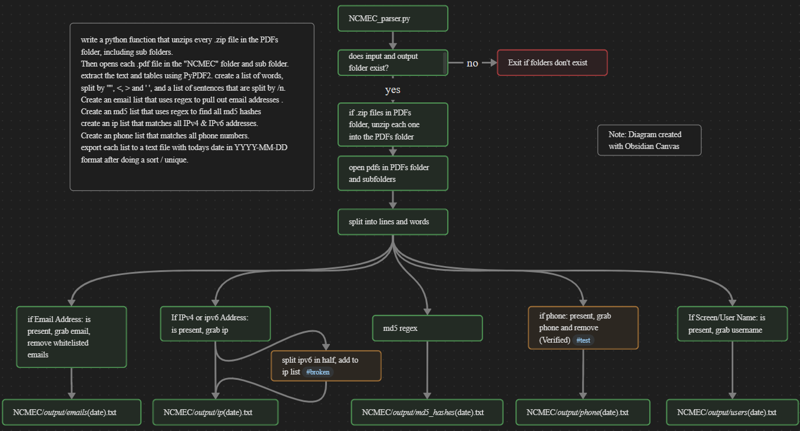

## NCMEC_PDF_parser.py 

Dump all of your NCMEC .zip or .pdf files into the NCMEC folder.
it will export the emails, ip's, md5's, phone numbers and users into _output folder

## Example:
    python NCMEC_PDFs_parser.py



## Note:
	try md5_hunter.py for one that just does md5's.


## Installation:
```
python pip install -r requirements_NCMEC.txt
```
or 
```
pip install pdfplumber
```


## Usage:


```
python NCMEC_PDF_parser.py
```


## Flowchart:
	



## Sample output: 

5 files unzipped in NCMEC folder

Processing PDFs in NCMEC folder....

NCMEC\1234\test1.pdf

NCMEC\2345\tes2.pdf

NCMEC\3456\test3.pdf

NCMEC\4567\test4.pdf

NCMEC\5678\test5.pdf

See text files in NCMEC\_output folder.

1 emails

14 IPs

5 MD5 hashes

1 phone numbers

3 users