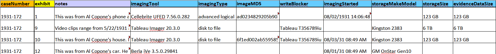
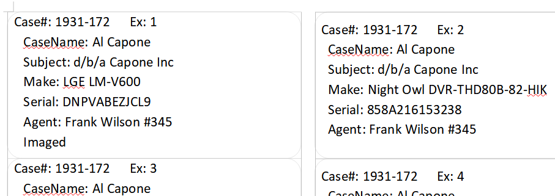
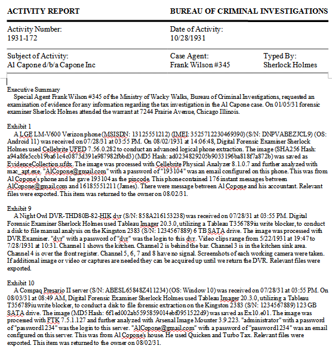
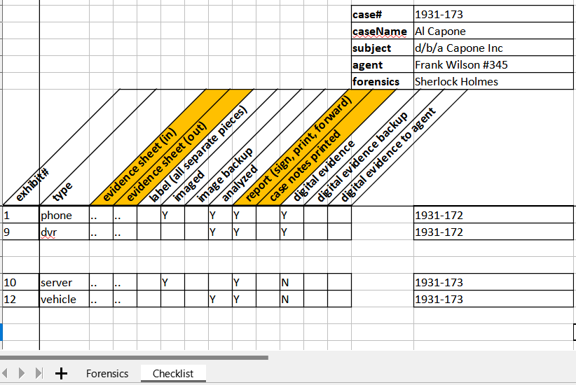
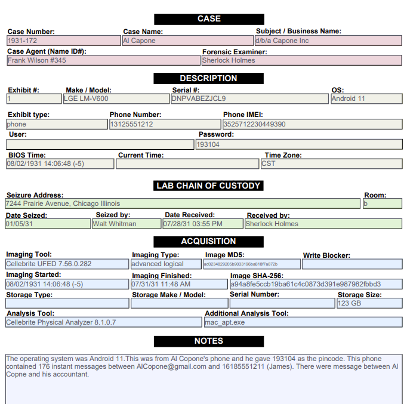
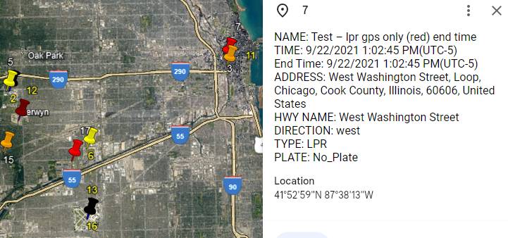
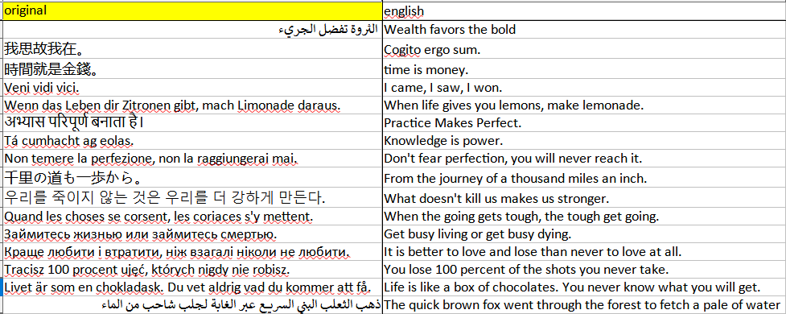
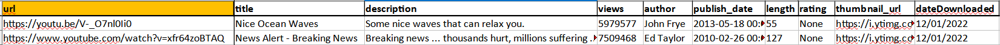
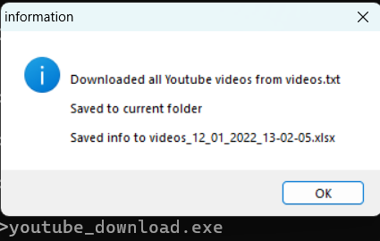

## ForensicsReporter.py 
Convert forensic imaging logs to xlsx, print stickers and write activity reports/ case notes

### -l # parse any of the following imaging logs:
* Cellebrite
* Tablaue
* Berla
* Cellebrite
* FTK
* Tableau

Installation:
```
python pip install -r requirements_ForensicsReporter.txt
```

Usage:\
process one log at a time by putting your log into input.txt
```
python ForensicsReporter.py -l
```
or do many at once by putting many logs into /Logs folder
```
python ForensicsReporter.py -L
```


### -s # print stickers
paste 1 or more rows from the spreadsheet into input.txt, print out stickers for labeling evidence\
(future plan: print avery labels with QR codes)

Usage:
```
python ForensicsReporter.py -s
```



### -r or -r -c
print out a report. You can replace Blank_ActivityReport.docx with your report template. (sorry it doesn't print data into the header area)\
if you do the -c option you can also replace Blank_EvidenceForm.pdf with your case notes pdf as long as you replace the variables.

Usage:
-r for just activity report
```
python ForensicsReporter.py -r
```





or do -r -c for case notes output (and activity report)
```
python ForensicsReporter.py -r -c
```



## GPS2Address.py

Usage:
```
python GPS2Address.py -r
```
insert your GPS or addresses into locations.xlsx
```
Example:
    GPS2Address.py -c -O input_blank.xlsx
    GPS2Address.py -k -I locations.xlsx  # xlsx 2 kml with no internet processing
    GPS2Address.py -r
    GPS2Address.py -r -I locations.xlsx -O locations2addresses_.xlsx
```    


---
## translatinator.py
<div style="background-color: red; color: white; padding: 10px;">
    Note: Google Translate module stops working every once in a while.
</div>
Read input_translate.xlsx filled with another language and translate it to English using Google Translate. 
The default is any language but if you know it's Chinese, for example, add a -c.

Usage:
```
python translatinator.py
```
or the exe version
```
translatinator.exe
```
or when you specify a specific language
```
python translatinator.py -c	# for chinese translation
```

Language switches:

*   -a  # arabic 2 english
*   -c  # chinese 2 english
*   -f  # french 2 english
*   -g  # german 2 english
*   -s  # spanish 2 english



---

## youtube_download.py
Download a list of Youtube videos from videos.txt, save list in xlsx file


Installation:
```
python pip install -r requirements_youtube.txt
```

Usage:
```
python youtube_download.py
```
or the exe version
```
youtube_download.exe
```


