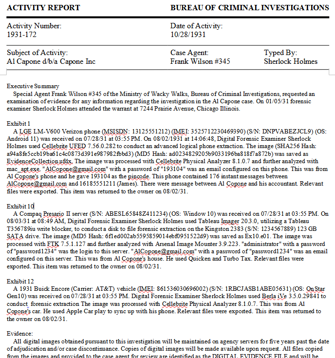
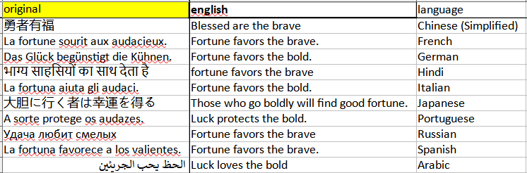

## ForensicsReporter.py
Convert forensic imaging logs to xlsx, print stickers and write activity reports/ case notes

### -l # parse any of the following imaging logs:
* Cellebrite
* Tablaue
* Berla
* Cellebrite
* FTK
* Tableau


Usage:
process one log at a time by putting your log into input.txt
```
python ForensicsReporter.py -l
```
or do many logs at once by putting log into /Logs folder
```
python ForensicsReporter.py -L # process many logs at once, by putting logs into the Logs folder
```


### -s # print stickers
paste 1 or more lines from the spreadsheet into input.txt, print out stickers for labeling evidence

Usage:
```
python ForensicsReporter.py -s
```

### -r or -r -c
print out a report. You can replace Blank_ActivityReport.docx with your report template. (sorry it doesn't print data into the header area)\
if you do the -c option you can also replace Blank_EvidenceForm.pdf with your case notes pdf as long as you replace the variables.

Usage:
-r for just activity report
```
python ForensicsReporter.py -r
```


or do -r -c for case notes output (and activity report)
```
python ForensicsReporter.py -r -c
```


## translatinator.py
Read input.xlsx filled with another language and translate it to english using Google Translate. 
The default is any language but if you know it's Chinese, for example, add a -c.

Usage:
```
python translatinator.py
```
or the exe version
```
translatinator.exe
```
or when you specify a specific language
```
python translatinator.py -c	# for chinese translation
```

Language switches:

*   -a  # arabic 2 english
*   -c  # chinese 2 english
*   -f  # french 2 english
*   -g  # german 2 english
*   -s  # spanish 2 english


