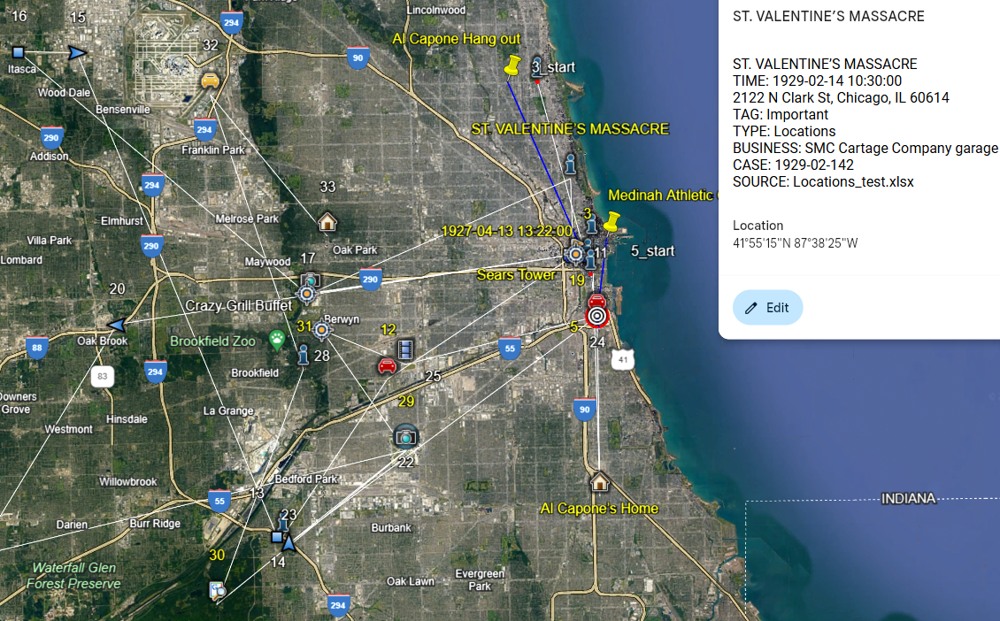

## GPS2Address.py

Usage:
```
python GPS2Address.py -r
```
insert your GPS or addresses into locations.xlsx
```
Example:
    GPS2Address.py -c -O input_blank.xlsx
    GPS2Address.py -k -I locations.xlsx  # xlsx 2 kml with no internet processing
    GPS2Address.py -r
    GPS2Address.py -r -I locations.xlsx -O locations2addresses_.xlsx
```    
*   Visit earth.google.com, File,Import KML 



Icons
*   Car -Lpr red car (License Plate Reader)
*   Car2 -Lpr yellow car
*   Car3 -Lpr greeen car with circle
*   Car4 -Lpr red car with circle
*   Truck -Lpr truck
	
*   Calendar
*   Home
*   Images -Photo
*   Intel -I
*   Locations -Reticle
*   default -Yellow flag
*   Office
*   Searched -Searched Item
*   Videos -Video clip
	
*   Toll -Blue square
*   N -Northbound blue arrow
*   E -Eastbound blue arrow
*   S -Southbound blue arrow
*   W -Westbound blue arrow
	
*   Chats
*   Tower -Bullseye

*   Yellow font -Tagged
*   blue lines -trips with a start and end
*   red circles -indicate radius of the signal and/or accuracy of the point

---
## translatinator.py

Add foreign text in the first column of input_translate.xlsx and translate it to English. 

Usage:
```
python translatinator.py
```
or the exe version ([download here](https://drive.google.com/file/d/1ZbxsdG-ezmRQThOb5VEIBRgS1IIqEA4E/view?usp=sharing))
(use auto-py-to-exe to make your own exe's)
```
translatinator.exe
```


---

## youtube_download.py
Download a list of Youtube videos from videos.txt, save list in xlsx file


Installation:
```
python pip install -r requirements_youtube.txt
```

Usage:
```
python youtube_download.py
```
or the exe version
```
youtube_download.exe
```


