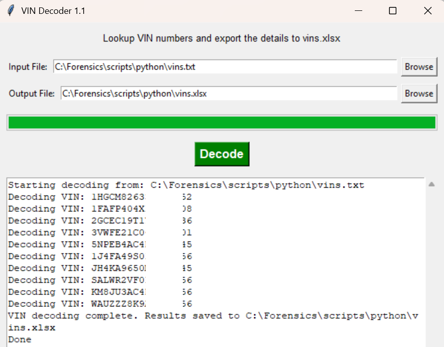
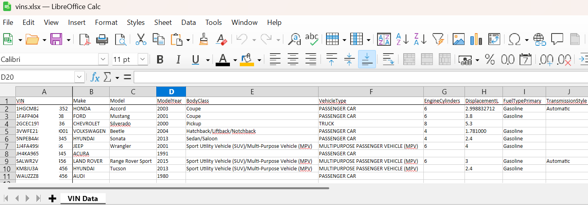

\### VIN Decoder (`VIN\_Decoder.py`)


Decodes a list of Vehicle Identification Numbers (VINs) using the NHTSA API and exports details to an Excel file.


Features:

GUI Mode: Launches by default.

	Input File: Select a text file containing one VIN per line (Defaults to `vins.txt`).

	Output File: Select the destination Excel file (Defaults to `vins.xlsx`).

	Progress Tracking: Visual progress bar and detailed logs.

CLI Mode: Currently defaults to GUI; main logic refactored for flexibility.


Dependencies:

`requests`

`openpyxl`

`tkinter` (standard library)


\## Usage


Running with GUI:

Simply run the script via python:

```bash

python VIN\_Decoder.py

```

	
	

	


