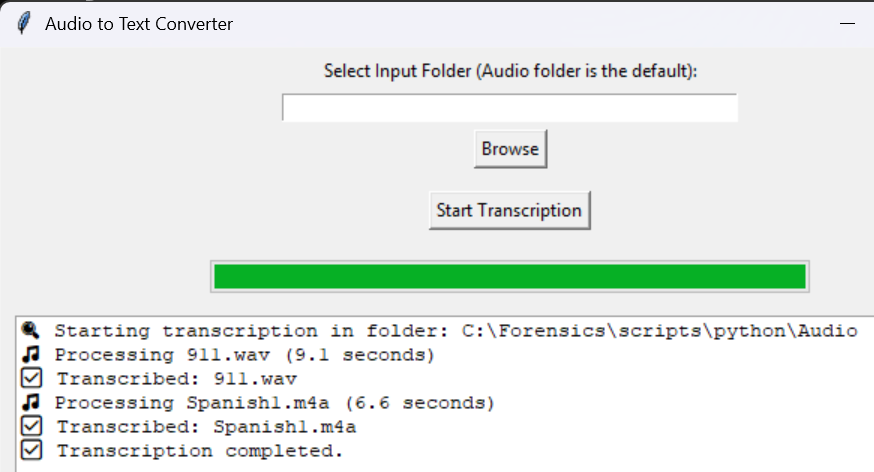

# Audio2Txt - Audio to Text Transcription Tool

A Python GUI application that converts audio files (WAV, MP3, M4A) to text transcripts using Google's Speech Recognition API.

## Features

- **User-Friendly GUI**: Simple Tkinter interface for easy operation
- **Multiple Format Support**: Handles WAV, MP3, and M4A audio files
- **Smart Chunking**: Automatically splits long audio files into 30-second segments to avoid API limitations
- **Batch Processing**: Process entire folders of audio files at once
- **Progress Tracking**: Real-time progress bar and detailed logging
- **Cross-Platform**: Works on Windows, macOS, and Linux

## Prerequisites

### 1. Python
- Python 3.6 or higher

### 2. FFmpeg
FFmpeg is required for audio format conversion.

**Windows:**
1. Download FFmpeg from [https://ffmpeg.org/download.html](https://ffmpeg.org/download.html)
2. Extract the ZIP file
3. Add the `bin` folder path to your System Environment Variables under 'Path'

**macOS:**
```bash
brew install ffmpeg
```

**Linux (Debian/Ubuntu):**
```bash
sudo apt install ffmpeg
```

**Linux (Fedora):**
```bash
sudo dnf install ffmpeg
```

## Installation

1. Clone or download this repository

2. Install Python dependencies:
```bash
pip install -r requirements_audio2txt.txt
```

Or install manually:
```bash
pip install SpeechRecognition pydub
```

## Usage

### Running the Application

Simply run the script:
```bash
python Audio2Txt.py
```

	
	


### Using the GUI

1. **Select Input Folder**: Click "Browse" to select the folder containing your audio files (defaults to `./Audio` folder)
2. **Click "Start Transcription"**: The script will process all supported audio files in the selected folder
3. **Monitor Progress**: Watch the progress bar and log messages for real-time status updates
4. **Find Transcripts**: Completed transcripts are saved in a `Transcripts` subfolder within your input folder

### Supported Audio Formats

- `.wav` - WAV audio files
- `.mp3` - MP3 audio files
- `.m4a` - M4A audio files

## How It Works

1. **Audio Conversion**: Converts input audio to 16kHz mono WAV format for optimal speech recognition
2. **Duration Detection**: Checks audio file length
3. **Smart Processing**:
   - Files ≤30 seconds: Processed in one request
   - Files >30 seconds: Split into 30-second chunks and processed sequentially
4. **Transcription**: Uses Google Speech Recognition API to convert speech to text
5. **Output**: Saves transcripts as `.txt` files with the same name as the original audio file

## Limitations

- **Internet Required**: Uses Google's online Speech Recognition API
- **Language**: Currently configured for English (en-US)
- **Accuracy**: Depends on audio quality, clarity of speech, and background noise
- **API Limits**: Free Google API has usage limitations

## Troubleshooting

### "FFmpeg Not Found" Error
Make sure FFmpeg is installed and added to your system PATH. Restart your terminal/command prompt after installation.

### "Bad Request" Error
This usually means the audio file is too long or has quality issues. The updated script handles this by chunking, but if it persists:
- Check audio quality
- Ensure the file isn't corrupted
- Try a shorter audio sample

### "No Speech Detected"
- Verify the audio file contains clear speech
- Check volume levels aren't too low
- Reduce background noise

## License

This project is provided as-is for forensic and transcription purposes.

## Author

Created for digital forensics and audio analysis workflows.
