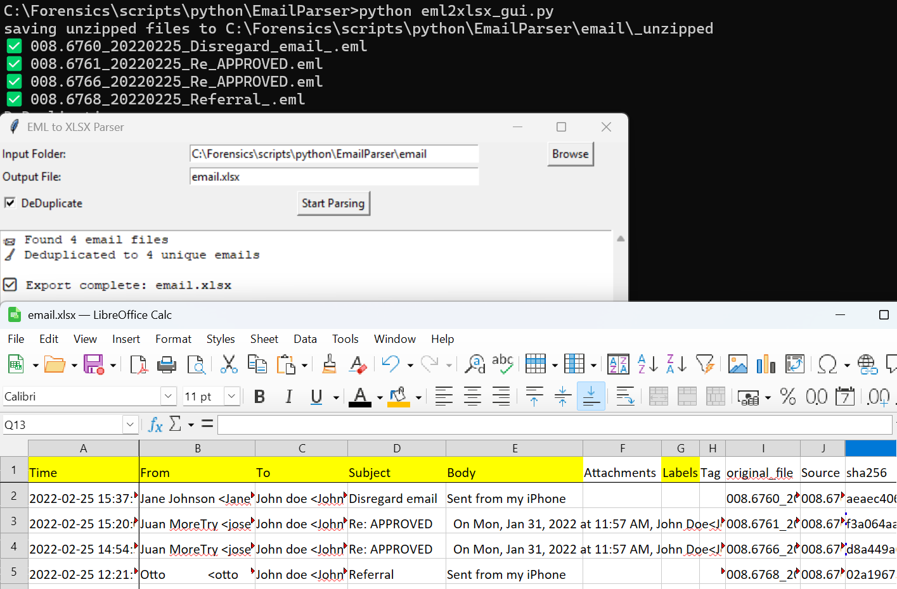

🕵️ ## EML to XLSX Parser GUI

A forensic-grade GUI tool for parsing .eml, .mbox, and .json email files into structured Excel workbooks. Designed for investigators, fraud analysts, and digital forensic workflows.

📦 Features
- ✅ GUI interface built with Tkinter
- ✅ Recursively extracts ZIP archives
- ✅ Parses .eml, .mbox, .json files
- ✅ Optional deduplication by SHA256 hash
- ✅ Exports to Excel with two sheets: Eml and Contacts

🖼️ Screenshots



🚀 Installation
```
git clone https://github.com/LincolnLandForensics/HodgePodge.git
```
cd eml2xlsx

```
pip install -r requirements_eml2xlsx.txt
```


🧪 Usage
```
python eml2xlsx_gui.py
```

- Select your input folder containing .eml, .mbox, .json, or .zip files
- Choose an output filename (e.g., email.xlsx)
- (Optional) Un-Check the DeDuplicate box to keep duplicate SHA256 hashes
- Click Start Parsing and monitor progress in the log window

📁 Output Structure
The Excel file contains:
Eml Sheet
- Time, From, To, Subject, Body, Attachments, Labels, Tags, Source, SHA256, and more
Contacts Sheet
- Extracted names, emails, and linkage to original files

🛠️ Customization
You can extend the parser by modifying eml_parser_core.py:
- Add tag classification logic
- Include additional metadata fields
- Export summary sheets or tag breakdowns

🧯 Troubleshooting
- ❌ Excel file not saving? Ensure the output path is writable
- ❌ Contacts missing? Check SHA256 presence or uncheck deduplication button
- ❌ ZIP extraction failed? Confirm archive integrity

📜 License
This project is licensed under the MIT License.
