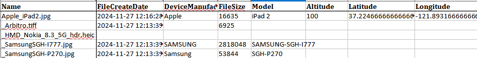

## exif_read.py 
extract exif data from images. Also hashes the file.

filetypes: .heic, .jpg, .jpeg, .png', .tiff, .tif, .webp


Installation:
```
python pip install -r requirements_exif_read.txt
```

Usage:

read exif data from images in the photos folder
```
python exif_read.py
```

Use -I to specify a different input folder (default is photos)
```
python exif_read.py -I photos
```

if you specify a bad folder name, it will yell at you
	
	
		
sample script output	
	
	
	
Sample xlsx output
	
	
	
Note: the output can be used with GPS2Address.py to convert it to a KML file for Google Earth visualizing.