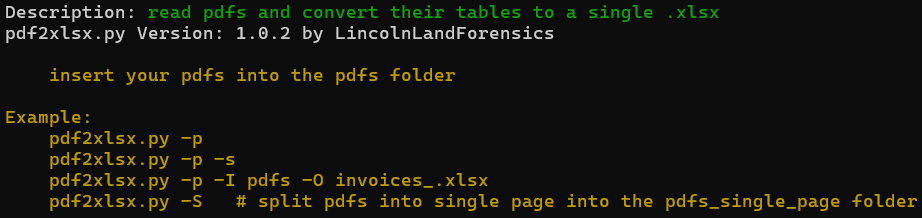
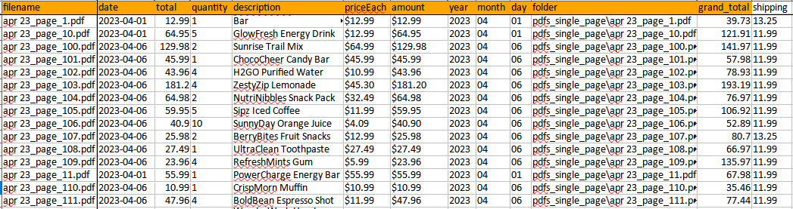

## pdf2xlsx.py

Usage:
```
python pdf2xlsx.py -p
```
read pdfs and convert their tables to a single .xlsx

Insert your pdfs into the 'pdfs' folder

-S split pdfs into single page into the pdfs_single_page folder

```
Example:
    pdf2xlsx.py -p
    pdf2xlsx.py -p -s
    pdf2xlsx.py -p -I pdfs -O invoices_.xlsx
    pdf2xlsx.py -S   # split pdfs into single page into the pdfs_single_page folder
```    







## pdf_tables2xlsx.py

use pdf_tables2xlsx.py to convert pdf's with tables into xlsx

note: PDF's are all different and take massaging and experimenting to get them to export correctly.

