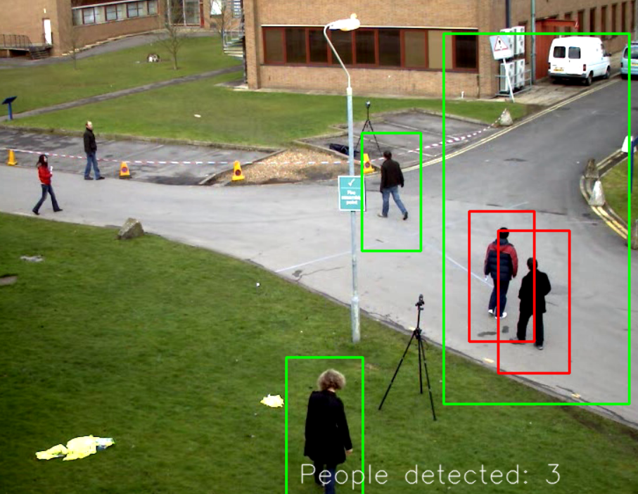
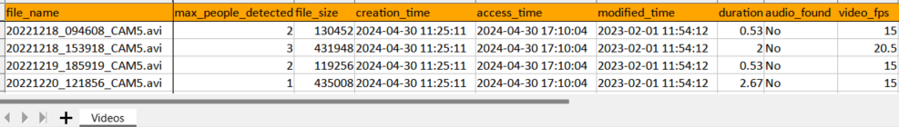

## peopleCount2.py 
counts the approximate number of people in a folder of videos

This needs tuning to get accurate numbers. It's a ballpark guess right now.

Installation:
```
python pip install -r requirements.txt
```

Usage:


```
python peopleCount2.py
```

Use -I to specify a different video folder (default is videos)
```
python peopleCount2.py -I videos
```

if you specify a non existent folder it will create one for you. Fill it with videos.

help

```
python peopleCount2.py -h
```
usage: peopleCount2.py [-h] [-I INPUT] [-O OUTPUT] [-c] [-H] [-v] [-p PROCESSES]

counts the approximate number of people in a folder of videos

options:
  -h, --help            show this help message and exit
  -I INPUT, --input INPUT
                        Input folder with videos
  -O OUTPUT, --output OUTPUT
                        Output Excel file
  -c, --count           Count people
  -H, --Help            Display help
  -v, --video           Display video while processing
  -p PROCESSES, --processes PROCESSES
                        Number of parallel processes
						

Sample video analysis



Output example 

