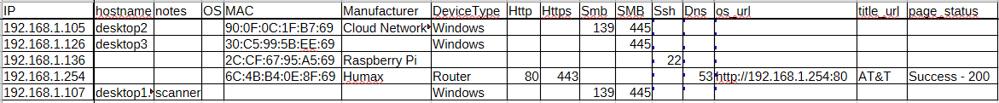
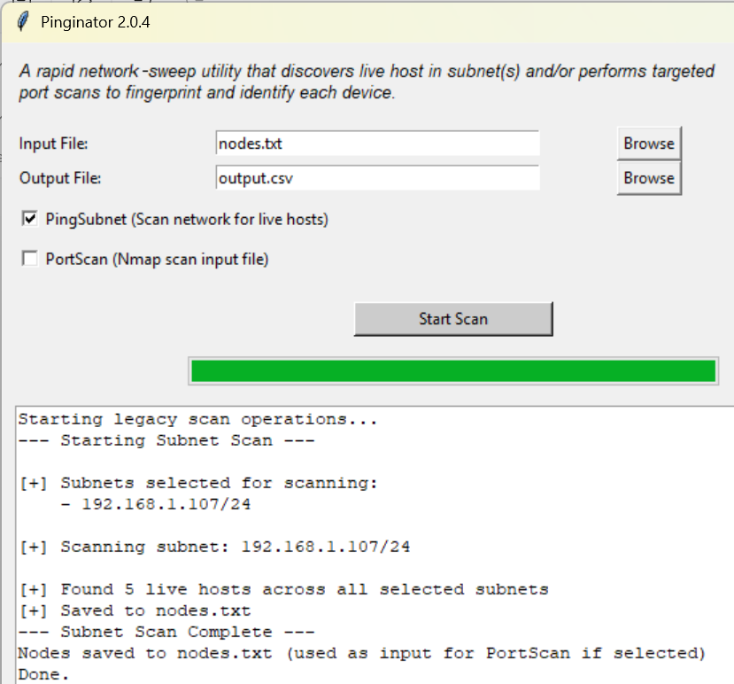
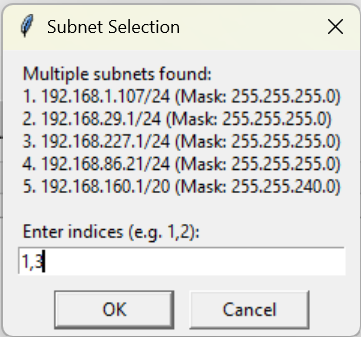
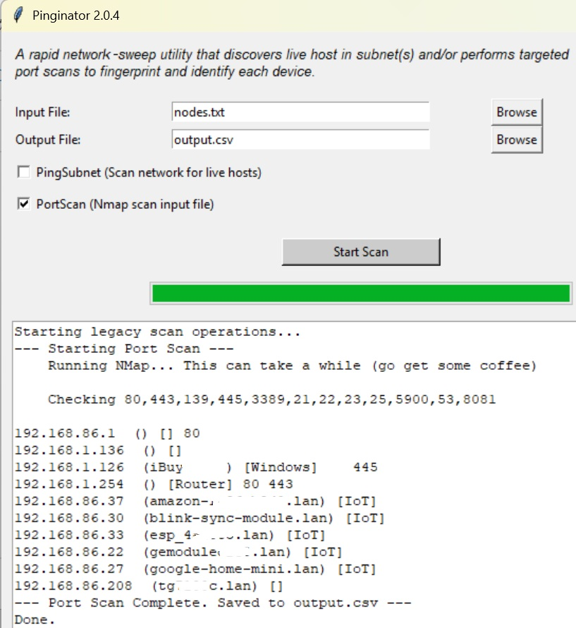
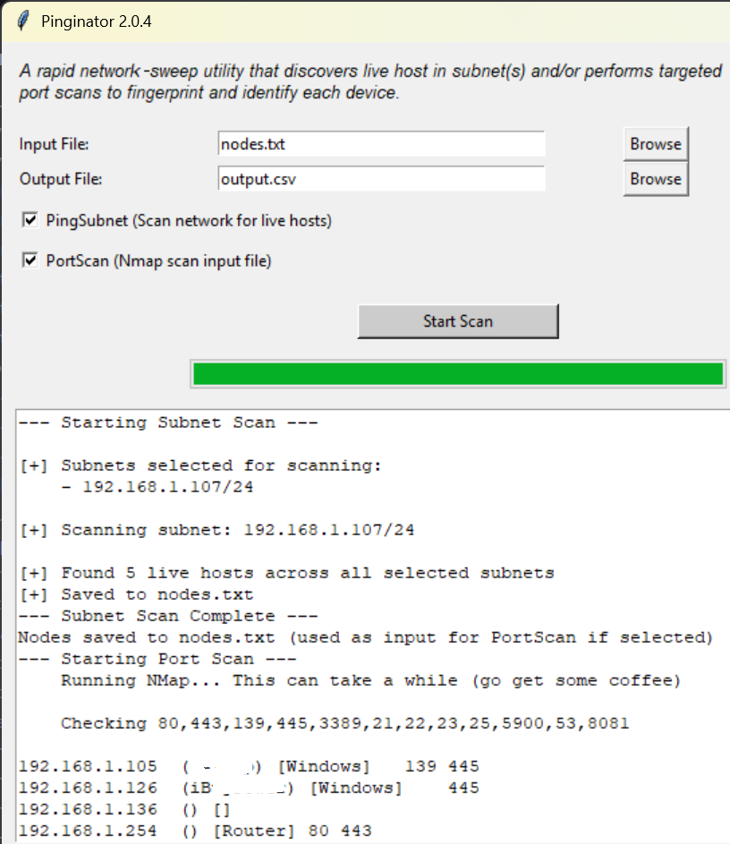

# Pinginator

**Pinginator** is a powerful, cross-platform network forensic utility designed for rapid network sweeps and targeted port scanning. It helps investigators and security professionals discover live hosts subnet(s) and fingerprint them through identified ports, MAC addresses, and service titles.

	


## Features

- **Dual Mode Interface**: Seamlessly switch between a modern **Tkinter GUI** and a robust **Command Line Interface (CLI)**.
- **Network Discovery**: Automatically detects local IPv4 subnets (Windows & Linux) and performs ICMP/ARP sweeps to identify live hosts.
- **Targeted Port Scanning**: Integrates with `nmap` to perform service fingerprinting on a customizable set of common ports.
- **Device Identification**: Heuristics to identify devices such as routers, Windows machines, and various IoT devices (Amazon, Google Home, Blink, etc.).
- **Web Service Fingerprinting**: Automatically extracts HTML titles from identified HTTP/HTTPS services.
- **Network Forensic Artifacts**: Maps IP addresses to hostnames and identifies the "scanner" machine.
- **Export Consistency**: Generates structured CSV reports containing IP, MAC, Manufacturer, Device Type, and open ports.

## Requirements

- **Python 3.x**
- **Nmap**: Must be installed and available in the system PATH.
- **Permissions**: Some Nmap scans may require administrative/root privileges.

## Usage

### GUI Mode
Simply run the script without arguments to launch the graphical interface:
```bash
python pinginator.py
or
sudo python pinginator.py # for linux
```
1. **Input File**: Specify where to save discovered hosts or which file to scan.
2. **PingSubnet**: Check this to scan the local network first.
3. **PortScan**: Check this to perform a light fingerprinting on the hosts in the input file.
4. **Start Scan**: Click to begin.

You just ping 1 or more subnets:
	

If multiple subnets are found, you select which subnets to ping:

	

You can just port scan a set of IP's:
	

You can ping and port scan all at once:
	

You have options.


### CLI Mode
Use command-line arguments for automated or remote execution:

| Argument | Description | Default |
| :--- | :--- | :--- |
| `-I`, `--input` | Input file for host list | `nodes.txt` |
| `-o`, `--output` | Output CSV file | `output.csv` |
| `-S`, `--subnet` | Perform a subnet discovery scan | Disabled |
| `-N`, `--nmap` | Perform an Nmap port scan | Disabled |

#### Examples:
**Scan for live hosts in the local subnet:**
```bash
sudo python pinginator.py -S -I live_hosts.txt
```

**Perform a port scan/fingerprinting on a list of IPs:**
```bash
sudo python pinginator.py -N -I live_hosts.txt -o forensic_report.csv
```

## Forensic Use Case
Pinginator is designed to assist in network forensics by:
1. Finging and fingerprinting all nodes in a network.
2. Identifying the host machine ("scanner") to exclude its own traffic from analysis.
3. Mapping MAC addresses to manufacturers to quickly ID devices.
4. Correlating service banners and web titles.


