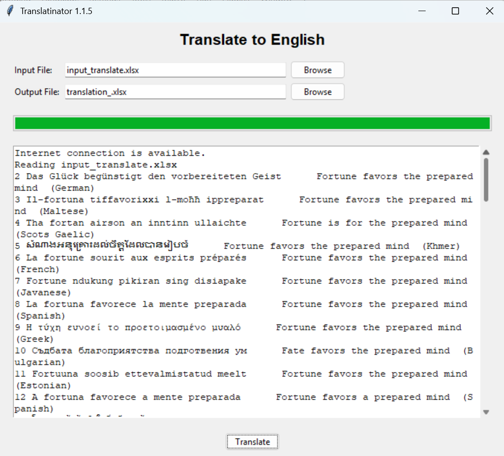
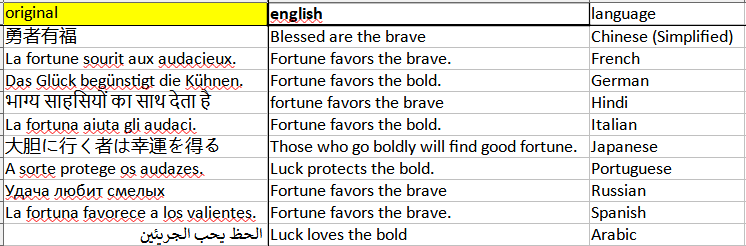

## translatinator.py

Add foreign text in the first column of input_translate.xlsx and translate it to English. 

Usage:
```
python translatinator.py
```





or the exe version ([download here](https://drive.google.com/file/d/1ZbxsdG-ezmRQThOb5VEIBRgS1IIqEA4E/view?usp=sharing))
(use auto-py-to-exe to make your own exe's)
```
translatinator.exe
```


