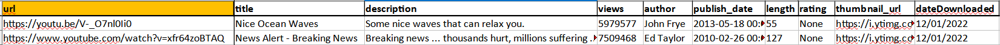
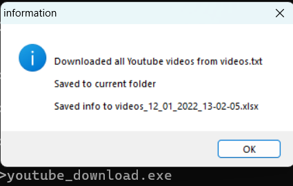

## youtube_download.py
Download a list of Youtube videos from videos.txt, save list in xlsx file


Installation:
```
python pip install -r requirements_youtube.txt
```

Usage:
```
python youtube_download.py
```
or the exe version
```
youtube_download.exe
```


